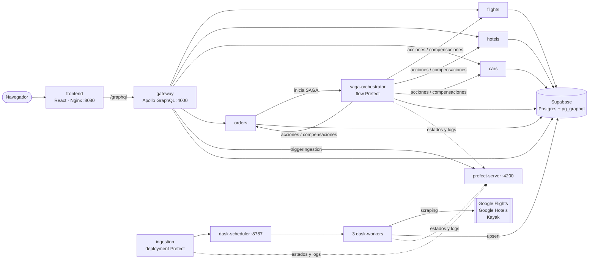

# 🧭 WanderSync Travel Solutions

**Plataforma de Empaquetamiento Turístico Dinámico** — Parcial práctico del segundo corte de *Patrones Arquitectónicos
Avanzados*.

Miembros: Valentina Ruiz Torres y Darek Aljuri Martinez

Arma paquetes **vuelo + hotel + auto** con **precios reales** extraídos de Google Flights, Google Hotels y Kayak por un
clúster de **Dask** orquestado con **Prefect**, los expone por un **API Gateway GraphQL** y los reserva con el
**patrón SAGA**, que compensa automáticamente cualquier fallo para que nunca queden "reservas huérfanas". Todo se
despliega con **un solo comando de Docker Compose**.

| Tecnología obligatoria | Dónde está |
|---|---|
| 🐳 **Docker Compose** | [`docker-compose.yml`](docker-compose.yml): 14 contenedores, 2 redes, healthchecks, un comando |
| 🔷 **GraphQL** | Gateway Apollo en [`services/gateway`](services/gateway) + `pg_graphql` de Supabase en los microservicios |
| 🔁 **Patrón SAGA** | Orquestación con compensaciones en [`services/saga-orchestrator/app/saga.py`](services/saga-orchestrator/app/saga.py) |
| ⚡ **Dask** | Scheduler + 3 workers ejecutando scraping, limpieza y carga en [`pipeline/`](pipeline) |
| 🌊 **Prefect** | Flow de ingesta con reintentos + cada SAGA es un flow run; UI en `:4200` |

📄 **Documentación**
- [Documento técnico de arquitectura](docs/ARQUITECTURA.md): diagramas, secuencias SAGA (éxito y compensación), ADRs, rúbrica.
- [Guion de la demostración en vivo](docs/GUION-DEMO.md): paso a paso con comandos y qué decir.
- [Web scraping e ingesta distribuida](docs/SCRAPING.md): fuentes, selectores, reintentos.
- [Ciberseguridad por diseño](docs/SEGURIDAD.md): Session Fixation, Argon2id, rate limiting y auditoría de dependencias.

---

## Arquitectura en una imagen



---

## Puesta en marcha

### Requisitos
- **Docker Desktop** (≥ 8 GB de RAM asignados; el clúster usa ~6 GB con los 3 workers con Chromium).
- Un proyecto de **Supabase** (Postgres + `pg_graphql`), requerido por el enunciado.
- Node 20+ solo si quieres correr los scripts de verificación desde el host.

### 1. Configurar variables

```bash
cp .env.example .env
```

Completa en `.env`:

| Variable | Valor |
|---|---|
| `DATABASE_URL` | Supabase → **Connect → Session pooler** (IPv4, puerto 5432). Ver nota abajo. |
| `SESSION_SECRET` | 64 caracteres aleatorios: `node -e "console.log(require('crypto').randomBytes(32).toString('hex'))"` |
| `INTERNAL_API_TOKEN` | Otro valor aleatorio |

> **Supabase y Docker en Windows:** usa la cadena del **Session pooler**
> (`postgresql://postgres.<ref>:<password>@aws-0-<region>.pooler.supabase.com:5432/postgres`). La *Direct connection*
> (`db.<ref>.supabase.co`) es solo IPv6 y Docker Desktop normalmente no tiene salida IPv6. No hay que crear tablas a
> mano: el contenedor `migrator` aplica [`db/migrations`](db/migrations) al arrancar.

### 2. Levantar todo

```bash
docker compose up --build
```

La primera construcción tarda ~5–8 min (Chromium y dependencias de Python). Al arrancar, el servicio `ingestion`
dispara automáticamente la **primera ingesta** (~1–2 min) para poblar el catálogo.

### 3. Abrir

| Qué | URL |
|---|---|
| **Aplicación** | http://127.0.0.1:8080 |
| **Prefect UI** (flows de ingesta y de SAGA) | http://127.0.0.1:4200 |
| **Dask Dashboard** (workers en vivo) | http://127.0.0.1:8787/status |
| **Apollo Sandbox** (explorar el esquema GraphQL) | http://127.0.0.1:4000/graphql |

> Usa `127.0.0.1` en vez de `localhost` en Windows: evita que el navegador resuelva a IPv6 (`::1`) y choque con
> *relays* viejos de Docker Desktop.

---

## Qué probar

1. **Armar un paquete** → elige destino, vuelo, hotel y auto → *Reservar paquete* → la pestaña **Mis reservas**
   muestra la **línea de tiempo de la SAGA** en vivo y el enlace al flow run en Prefect.
2. **Simular un fallo** → en el selector *Modo demo* elige "Falla el servicio de Autos" → verás los reintentos y luego
   la compensación del hotel y el vuelo, en orden inverso.
3. **Ingesta** → pestaña **Ingesta de datos** → sube la tasa de caos a 30 % → *Ejecutar ingesta ahora* → en Prefect
   aparecen tareas en `AwaitingRetry`, y en el Dask Dashboard los 3 workers trabajando.
4. **Inspector GraphQL** (botón negro abajo a la derecha) → cada operación que envía el navegador, con sus campos
   exactos, tamaño y tiempo.

### Verificación automatizada

Con el sistema arriba, desde la raíz del repo:

```bash
node scripts/e2e/saga-scenarios.mjs
```

```bash
node scripts/security/security-tests.mjs
```

```bash
cd pipeline && python -m unittest discover tests -v
```

Auditoría de dependencias (genera reportes en `docs/security/reports/`):

```bash
powershell -ExecutionPolicy Bypass -File scripts/security/audit.ps1
```

### Resultados verificados (27-sep-2026, despliegue limpio con `docker compose down -v && up`)

| Verificación | Resultado | Evidencia |
|---|---|---|
| Arranque completo con un comando | 14/14 contenedores `Up`/`healthy`, migraciones aplicadas | `docker compose ps` |
| Ingesta real distribuida (12 tareas, 3 workers) | `COMPLETED` · 48 vuelos, 48 hoteles, 45 autos en ~40 s | Prefect → Runs · artefacto `ingesta-detalle` |
| Ingesta con 30 % de fallos inyectados | `COMPLETED` 0/12 fallidas gracias a los reintentos | Prefect → tareas en *AwaitingRetry* |
| SAGA: 5 escenarios (éxito + 4 fallos) | 5/5 pasan; inventario restaurado exactamente | [`docs/evidencias/saga-scenarios-2026-09-27.txt`](docs/evidencias/saga-scenarios-2026-09-27.txt) |
| Seguridad (fixation, Argon2id, rate limiting, CSRF, profundidad, token interno) | 14/14 pasan | [`docs/security/reports/security-tests-2026-09-27.txt`](docs/security/reports/security-tests-2026-09-27.txt) |
| Auditoría de dependencias | 568 paquetes, 0 vulnerabilidades | [`docs/security/reports/`](docs/security/reports/) |
| Pruebas de parsers | 9/9 pasan | `python -m unittest discover tests` |

---

## Estructura del repositorio

```
├── docker-compose.yml             # despliegue completo (un comando)
├── .env.example                   # variables de entorno documentadas
├── db/migrations/                 # esquema: catálogo (pg_graphql), dominios, RLS
├── docker/node-service.Dockerfile # imagen genérica de los servicios Node
├── packages/common/               # utilidades compartidas: pg, pg_graphql, HTTP, inventario SAGA
├── services/
│   ├── gateway/                   # API Gateway GraphQL · identidad · rate limiting
│   ├── flights/  hotels/  cars/   # microservicios de inventario (participantes SAGA)
│   ├── orders/                    # órdenes y facturación (pago, reembolso, factura)
│   ├── saga-orchestrator/         # SAGA orquestada como flow de Prefect (Python)
│   └── migrator/                  # aplica las migraciones y termina
├── pipeline/                      # scrapers + flow Prefect sobre Dask (Python)
│   ├── wandersync/scrapers/       # Google Flights · Google Hotels · Kayak
│   └── tests/                     # pruebas de los parsers
├── frontend/                      # React + Apollo Client + Nginx
├── scripts/
│   ├── e2e/saga-scenarios.mjs     # verifica los 5 escenarios SAGA
│   └── security/                  # pruebas de seguridad + auditoría de dependencias
└── docs/                          # arquitectura, guion de demo, scraping, seguridad
```

## Comandos útiles

```bash
docker compose ps                                   # estado de los contenedores
docker compose logs -f saga-orchestrator            # logs de la SAGA
docker compose logs -f dask-worker-1 dask-worker-2  # logs de los workers
docker compose restart ingestion                    # re-publica el deployment y dispara una ingesta
docker compose down                                 # detener (conserva volúmenes)
docker compose down -v                              # detener y borrar volúmenes (historial de Prefect)
```

## Solución de problemas

| Síntoma | Causa probable / solución |
|---|---|
| `migrator` sale con error de conexión | `DATABASE_URL` mal copiada, o se usó la *Direct connection* IPv6 de Supabase → usa el Session pooler |
| El catálogo sale vacío | La primera ingesta aún corre: mira `http://127.0.0.1:4200` → Runs, o `docker compose logs ingestion` |
| Una fuente queda en 0 (corrida `PARTIAL`) | La fuente cambió su HTML o limitó la IP; las otras fuentes y el catálogo previo siguen funcionando. Prueba `python -m wandersync.cli <fuente>` |
| `TOO_MANY_REQUESTS` | Es el rate limiting funcionando; espera el tiempo indicado en el mensaje |
| La UI de Prefect no carga datos | Abre `127.0.0.1:4200` (no `localhost`) o ajusta `PUBLIC_PREFECT_URL` |
