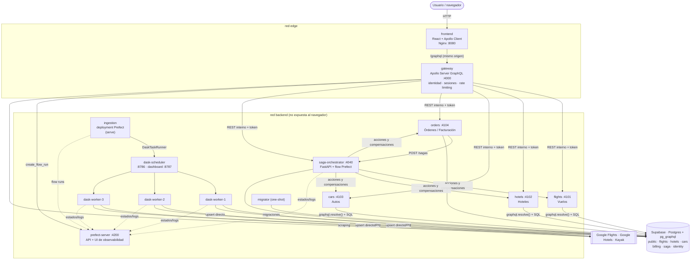
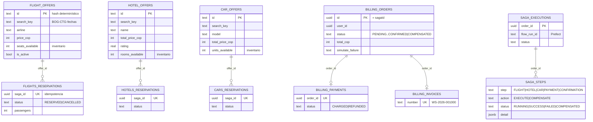
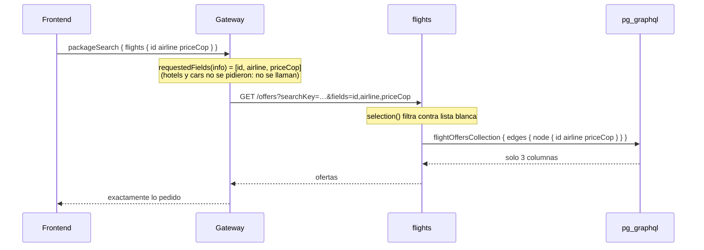
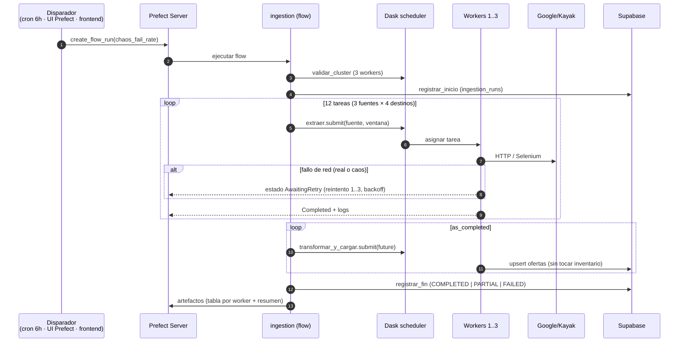
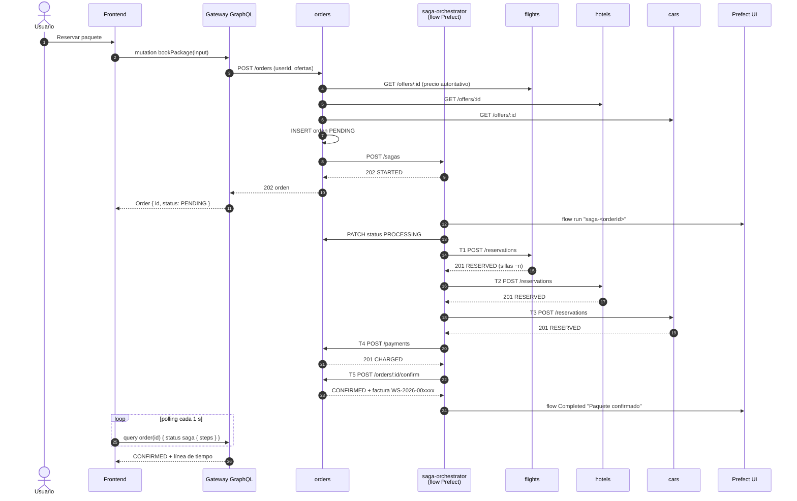
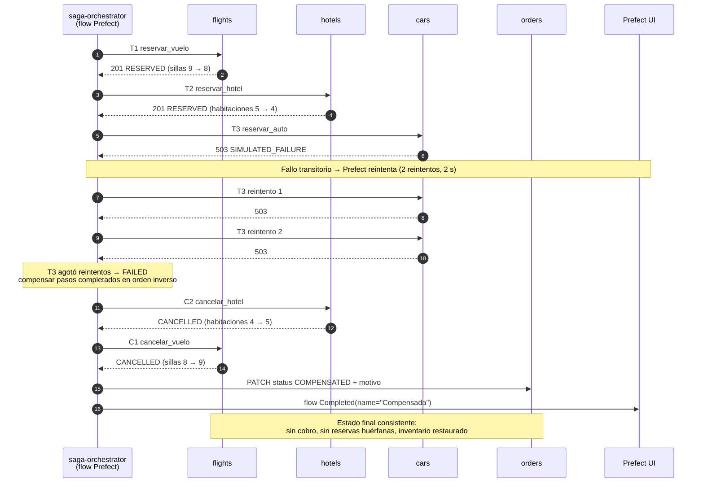
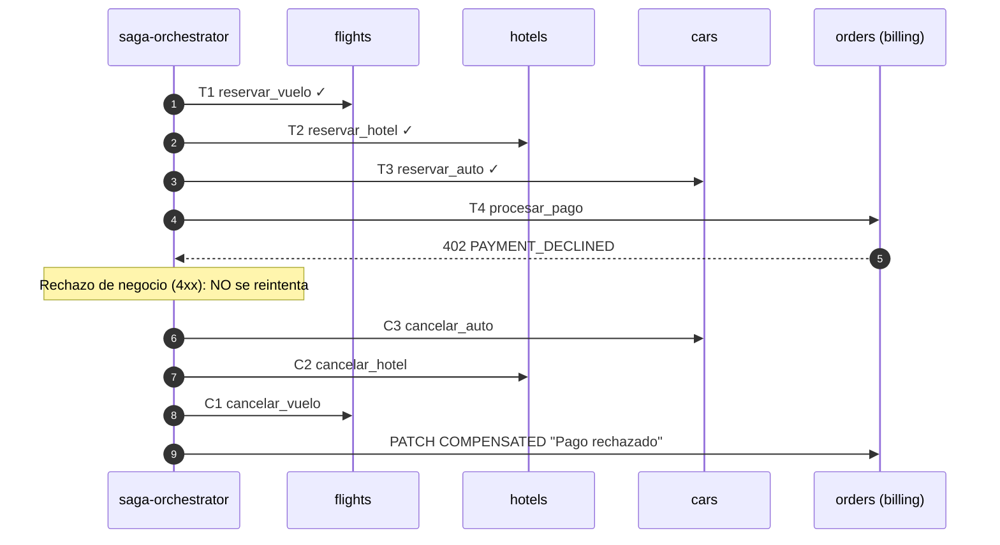
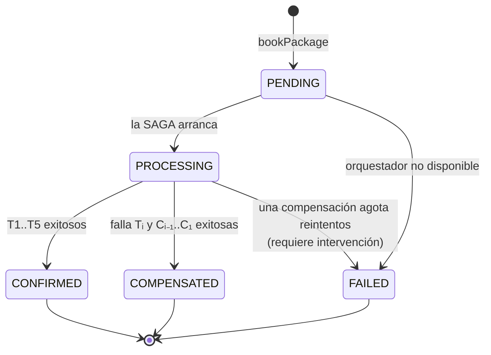

# Documento Técnico de Arquitectura — WanderSync Travel Solutions

**Asignatura:** Patrones Arquitectónicos Avanzados · Parcial práctico del segundo corte
**Proyecto:** Plataforma de Empaquetamiento Turístico Dinámico
**Tecnologías nucleares obligatorias:** Docker Compose · GraphQL · Patrón SAGA · Dask · Prefect

---

## Índice

1. [Problema y objetivos](#1-problema-y-objetivos)
2. [Vista general de la arquitectura](#2-vista-general-de-la-arquitectura)
3. [Microservicios y responsabilidades](#3-microservicios-y-responsabilidades)
4. [Datos: modelo y persistencia](#4-datos-modelo-y-persistencia)
5. [Ingesta distribuida: Dask + Prefect](#5-ingesta-distribuida-dask--prefect)
6. [API Gateway GraphQL](#6-api-gateway-graphql)
7. [Patrón SAGA](#7-patrón-saga)
8. [Ciberseguridad por diseño](#8-ciberseguridad-por-diseño)
9. [Despliegue con Docker Compose](#9-despliegue-con-docker-compose)
10. [Decisiones de arquitectura (ADR)](#10-decisiones-de-arquitectura-adr)
11. [Trazabilidad con la rúbrica](#11-trazabilidad-con-la-rúbrica)
12. [Limitaciones y trabajo futuro](#12-limitaciones-y-trabajo-futuro)

---

## 1. Problema y objetivos

La arquitectura previa de WanderSync presentaba dos fallas críticas:

| Problema | Síntoma | Solución en este diseño |
|---|---|---|
| **Reservas huérfanas** | Se cobraba y se reservaba el vuelo, pero si el hotel o el auto fallaban la orden quedaba indeterminada, sin rollback | **SAGA orquestada** con compensaciones automáticas, idempotentes y reintentables (§7) |
| **Cuellos de botella en la sincronización de tarifas** | La recolección masiva bloqueaba la persistencia y la red | **Ingesta asíncrona y distribuida** en un clúster Dask orquestado por Prefect, fuera del camino de las peticiones (§5) |
| **Dependencia de APIs comerciales** | APIs cerradas, costosas y restrictivas | **Web scraping** de fuentes públicas reales (Google Flights, Google Hotels, Kayak) |

Objetivos de calidad priorizados: **consistencia** (sin reservas huérfanas), **resiliencia** (fallos de red y de
servicios no rompen el sistema), **observabilidad** (todo flujo es visible en Prefect), **seguridad por diseño** y
**despliegue reproducible** con un solo comando.

---

## 2. Vista general de la arquitectura

### 2.1 Diagrama de contenedores



### 2.2 Estilo arquitectónico

- **Microservicios** con **base de datos lógica por servicio** (un esquema Postgres por servicio; ningún servicio lee
  las tablas de otro, se comunican por HTTP).
- **API Gateway** GraphQL como **único punto de entrada** del frontend (patrón *Backend for Frontend* unificado).
- **SAGA orquestada** para la transacción distribuida de reserva.
- **Master–Worker** (Dask) para la ingesta masiva, con **orquestación** y **observabilidad** en Prefect.
- **Defensa en profundidad**: segmentación de red, token interno entre servicios, RLS en la base de datos.

### 2.3 Stack

| Capa | Tecnología | Motivo |
|---|---|---|
| Frontend | React 18 + Vite + Apollo Client 3, servido por Nginx sin privilegios | Caché normalizada GraphQL, polling para seguir la SAGA |
| Gateway | Node 22, Express 5, Apollo Server 5, DataLoader | Ecosistema GraphQL más maduro; DataLoader elimina N+1 |
| Microservicios de dominio | Node 22 + Express 5 + `pg` | Ligeros, I/O intensivos, mismo stack que el taller SAGA |
| Orquestador SAGA | Python 3.11 + FastAPI + Prefect 3 | La SAGA es un flow de Prefect: observabilidad nativa |
| Ingesta | Python 3.11 + Dask 2026.8 + Prefect 3.8 + prefect-dask + Selenium + BeautifulSoup + pandas | Stack de datos estándar |
| Persistencia | Supabase (Postgres 17 + `pg_graphql`) | GraphQL nativo en la base de datos, requisito §3.3 |
| Contenedores | Docker Compose, 14 servicios (+1 BD local opcional), 2 redes | `docker compose up` |

---

## 3. Microservicios y responsabilidades

| Servicio | Tipo | Responsabilidad | Dueño de |
|---|---|---|---|
| `gateway` | Node | Esquema GraphQL unificado, identidad (registro/login), sesiones, rate limiting, composición de respuestas | esquema `identity` |
| `flights` | Node | Catálogo de vuelos (lectura por `pg_graphql`), inventario de sillas, reservar/cancelar vuelo | `public.flight_offers`, `flights.*` |
| `hotels` | Node | Catálogo de hoteles, inventario de habitaciones, reservar/cancelar | `public.hotel_offers`, `hotels.*` |
| `cars` | Node | Catálogo de autos, unidades disponibles, reservar/cancelar | `public.car_offers`, `cars.*` |
| `orders` | Node | Órdenes, **precios autoritativos**, pagos (cobro/reembolso), facturas; inicia la SAGA | esquema `billing` |
| `saga-orchestrator` | Python | Ejecuta la SAGA como flow de Prefect; bitácora de pasos | esquema `saga` |
| `ingestion` | Python | Publica el deployment de Prefect de la ingesta y ejecuta sus corridas | `public.ingestion_runs` |
| `dask-scheduler` + 3 workers | Python | Ejecutan scraping, limpieza y carga en paralelo | — |
| `prefect-server` | Python | API y UI de orquestación/observabilidad | SQLite en volumen |
| `migrator` | Node | Aplica `db/migrations/*.sql` (idempotentes) y termina | — |
| `frontend` | Nginx | Estáticos + proxy de `/graphql` + cabeceras de seguridad (CSP) | — |

### 3.1 Contrato REST interno de los participantes de inventario

Implementado una sola vez en [`packages/common/src/inventory.js`](../packages/common/src/inventory.js) y
configurado por cada servicio:

| Método | Ruta | Uso |
|---|---|---|
| GET | `/offers?searchKey=&limit=&fields=` | Catálogo de una ventana (con proyección de campos) |
| GET | `/offers?ids=a,b,c` | Lote por ids (lo usa el DataLoader del gateway) |
| GET | `/windows` | Ventanas disponibles (agregación SQL) |
| POST | `/reservations` | **Acción SAGA**: reservar (idempotente por `sagaId`) |
| POST | `/reservations/:sagaId/cancel` | **Compensación SAGA**: liberar (idempotente) |

---

## 4. Datos: modelo y persistencia

### 4.1 Esquemas



Además: `identity.users` (hash Argon2id), `identity.session` (sesiones de express-session) y
`public.ingestion_runs` (bitácora de ingesta).

### 4.2 Integración GraphQL nativa con la base de datos

El enunciado pide una base de datos con **soporte nativo o integración transparente con GraphQL**. Se usa
**Supabase `pg_graphql`**, la extensión que genera un esquema GraphQL a partir de las tablas de Postgres
(con `@graphql({"inflect_names": true})` los nombres quedan en camelCase: `flightOffersCollection`, `priceCop`).

Los microservicios no la invocan por HTTP sino con la función SQL **`graphql.resolve(query, variables)`**
([`pggraphql.js`](../packages/common/src/pggraphql.js)):

```sql
select graphql.resolve($1, $2::jsonb)
-- $1 = query Offers($key: String!, $first: Int!) {
--        flightOffersCollection(filter: {searchKey: {eq: $key}, isActive: {eq: true}},
--                               orderBy: [{priceCop: AscNullsLast}], first: $first) {
--          edges { node { id airline departTime priceCop } } } }
```

Ventajas: es el mismo motor que Supabase expone en `/graphql/v1`, pero **sin API keys adicionales**, dentro del
pool de conexiones del servicio y funcionando igual con Supabase en la nube o con la imagen local
`supabase/postgres`. Las **escrituras transaccionales** (reservas con `SELECT … FOR UPDATE`, decrementos de inventario)
y las **agregaciones** se hacen en SQL, porque requieren control de transacción que GraphQL no ofrece.

### 4.3 Sin over-fetching de punta a punta



---

## 5. Ingesta distribuida: Dask + Prefect

Detalle completo de fuentes y parsers en [SCRAPING.md](SCRAPING.md).

### 5.1 Separación de responsabilidades

| Prefect (orquestador) | Dask (motor de cómputo) |
|---|---|
| Define el flujo, dependencias y **políticas de reintento** | Distribuye tareas entre workers y reprograma si uno cae |
| Historial persistente de corridas, logs, artefactos, UI | Dashboard en vivo de CPU/memoria/tareas |
| Programación (cada 6 h) y ejecución bajo demanda | Paralelismo real (3 workers × 2 hilos) |
| Gobernanza: `validar_cluster`, estados `PARTIAL/FAILED` | Movimiento de datos entre workers (futures) |

Se integran con `DaskTaskRunner(address="tcp://dask-scheduler:8786")`: cada `.submit()` de Prefect se convierte en un
`client.submit()` de Dask. Los workers tienen `PREFECT_API_URL` para reportar el estado y los logs de cada tarea a la UI
de Prefect.

### 5.2 Secuencia de una corrida



### 5.3 Política de reintentos

```python
@task(retries=3, retry_delay_seconds=[3, 8, 15], retry_jitter_factor=0.3, timeout_seconds=180)
def extraer(source, window, chaos_fail_rate): ...
```

- **Backoff creciente** para dar tiempo a que se recupere la fuente o la red.
- **Jitter** para que varios workers no reintenten en sincronía contra el mismo sitio.
- Errores reintentables: fallo de red, HTTP 429/5xx, página sin resultados (`ScrapeEmptyError`) y fallos simulados.

---

## 6. API Gateway GraphQL

Esquema completo: [`services/gateway/src/schema.graphql`](../services/gateway/src/schema.graphql).

| Operación | Tipo | Descripción |
|---|---|---|
| `destinations` | Query | Ventanas de viaje consolidadas de los 3 servicios (conteos y precio mínimo) |
| `packageSearch(searchKey)` | Query | **Consolidación de disponibilidad**: `flights`, `hotels`, `cars`, `cheapestPackage`; cada campo se resuelve solo si se pide |
| `order(id)`, `myOrders` | Query | Orden con vuelo/hotel/auto (DataLoader) y bitácora de la SAGA; control de propiedad (anti-IDOR) |
| `ingestionRuns`, `platformLinks` | Query | Bitácora de ingesta leída por `pg_graphql`; enlaces a Prefect/Dask |
| `register`, `login`, `logout` | Mutation | Identidad con Argon2id y regeneración de sesión |
| `bookPackage(input)` | Mutation | Crea la orden y dispara la SAGA (respuesta inmediata, estado asíncrono) |
| `triggerIngestion(chaosFailRate)` | Mutation | Crea un flow run en Prefect vía su API REST |

Decisiones clave:

- **Resolvers por campo** (`PackageSearch.flights`, `.hotels`, `.cars`): si el cliente no pide autos, el servicio de
  autos ni se llama.
- **Proyección propagada** (§4.3) hasta `pg_graphql`.
- **DataLoader** por petición: N órdenes → 1 llamada `GET /offers?ids=…` por tipo (sin N+1).
- **Frontend exclusivamente GraphQL**: Nginx solo expone `/graphql`; el panel *Inspector GraphQL* del frontend
  muestra cada operación, su tamaño y tiempo (evidencia para la demo).
- **Endurecimiento**: límite de profundidad 6, `csrfPrevention`, errores internos ocultos, cuerpo máx. 100 KB.

---

## 7. Patrón SAGA

### 7.1 Variante elegida: **orquestación**

Un coordinador central (el flow `saga-reserva-paquete` de Prefect) decide el siguiente paso y, ante un fallo,
ejecuta las compensaciones en **orden inverso**. Implementación:
[`services/saga-orchestrator/app/saga.py`](../services/saga-orchestrator/app/saga.py).

| # | Acción (Tᵢ) | Participante | Compensación (Cᵢ) |
|---|---|---|---|
| 1 | `reservar_vuelo` — descuenta sillas | flights | `cancelar_vuelo` — devuelve sillas |
| 2 | `reservar_hotel` — descuenta habitación | hotels | `cancelar_hotel` |
| 3 | `reservar_auto` — descuenta unidad | cars | `cancelar_auto` |
| 4 | `procesar_pago` — cobra | orders (billing) | `reembolsar_pago` |
| 5 | `confirmar_orden` — emite factura (**pivote**) | orders | — (tras el pivote no se compensa) |

### 7.2 Diagrama de secuencia — camino exitoso (happy path)



### 7.3 Diagrama de secuencia — compensación (falla el servicio de autos)



### 7.4 Diagrama de secuencia — compensación (pago rechazado)



### 7.5 Máquina de estados de la orden



### 7.6 Garantías de consistencia

| Mecanismo | Dónde | Qué evita |
|---|---|---|
| **Idempotencia por `sagaId`** (`saga_id UNIQUE`) | reservas de flights/hotels/cars, `payments.order_id UNIQUE` | Que un reintento de Prefect duplique reservas o cobros |
| **Compensaciones idempotentes** | `cancel` sin reserva → `NOTHING_TO_COMPENSATE`; ya cancelada → `ALREADY_CANCELLED` | Que compensar dos veces libere inventario de más |
| **Reintento selectivo** (`retry_condition_fn`) | tareas Tᵢ | Reintentar 5xx/red; no reintentar 4xx de negocio |
| **Compensaciones con 5 reintentos** | tareas Cᵢ | Que una compensación falle por un error transitorio |
| **Transacciones locales + `FOR UPDATE`** | cada participante | Carreras al descontar inventario (`seats_available >= n`) |
| **Precios autoritativos** | orders consulta a cada servicio | Manipulación del precio desde el cliente |
| **Monto verificado en el pago** | `AMOUNT_MISMATCH` | Cobrar un valor distinto al de la orden |
| **Saga log** (`saga.steps`) | orquestador | Trazabilidad y recuperación: se sabe exactamente qué se hizo y qué se compensó |
| **Pivote** (`confirmar_orden`) | orders | Solo se factura cuando todo lo compensable ya se ejecutó |

### 7.7 Simulación de fallos (modo demo)

La mutación `bookPackage` acepta `simulateFailure: NONE | FLIGHT | HOTEL | CAR | PAYMENT`. El orquestador envía la
cabecera `x-simulate-failure: true` **solo** al participante elegido:

- `FLIGHT/HOTEL/CAR` → el servicio responde **503** (servicio caído): se ven los **reintentos** y luego la
  **compensación** de lo ya reservado.
- `PAYMENT` → la pasarela responde **402** (tarjeta rechazada): **sin reintentos**, compensación inmediata.

Evidencia automatizada: `node scripts/e2e/saga-scenarios.mjs` verifica los 5 escenarios y que el inventario vuelva
exactamente a su valor inicial tras cada compensación. Salida real en
[`evidencias/saga-scenarios-2026-09-27.txt`](evidencias/saga-scenarios-2026-09-27.txt) (extracto):

```
✔ PASA  Escenario CAR → orden COMPENSATED · Falló CAR: Fallo simulado en el servicio de autos (modo demo)
     → FLIGHT       SUCCESS
     → HOTEL        SUCCESS
     → CAR          reintento 1
     → CAR          reintento 2
     → CAR          FAILED
     ↩ HOTEL        COMPENSATED
     ↩ FLIGHT       COMPENSATED
     inventario Δ sillas 0, habitaciones 0, autos 0 (consistente)
```

### 7.8 Problemas encontrados durante la construcción (y cómo se resolvieron)

| Problema | Causa | Solución |
|---|---|---|
| Los reintentos de la SAGA no ocurrían | En tareas `async`, `state.result()` devuelve una corrutina y la condición de reintento siempre daba `False` | `retry_only_transient` inspecciona `state.data`, que Prefect llena con la excepción original |
| Las 12 extracciones "fallaban" en 1 s al correr desde el deployment | `serve()` cargaba el flow por ruta de archivo (módulo `flows`) y el scheduler de Dask no podía deserializar las tareas (`ModuleNotFoundError`) | Entrypoint por módulo: `EntrypointType.MODULE_PATH` (`wandersync.flows:ingesta_turistica`) |
| El scheduler de Prefect fallaba al programar corridas | SQLAlchemy 2.1 (dependencia transitiva) es incompatible con Prefect 3.8 | Versión fijada `sqlalchemy==2.0.54` |
| La UI de Prefect respondía 404 | El servidor corre sin root y no podía escribir la UI en `site-packages` | `PREFECT_UI_STATIC_DIRECTORY` en un directorio escribible |
| Kayak no devolvía autos para San Andrés | En la isla no hay alquiler de autos en Kayak (dato real) | Destino reemplazado por Cali; la corrida original terminó `PARTIAL` como estaba previsto |

---

## 8. Ciberseguridad por diseño

Detalle y evidencias en [SEGURIDAD.md](SEGURIDAD.md).

| Requisito | Implementación |
|---|---|
| Session Fixation | `req.session.regenerate()` tras login/registro; el id anterior se destruye en el store; cookie `HttpOnly`, `SameSite=Strict`, `Secure` opcional, expiración 2 h |
| Hashing robusto | **Argon2id** m=64 MiB, t=3, p=1; hash señuelo contra enumeración de usuarios por tiempo |
| Rate limiting | Login (5/min por IP+cuenta con bloqueo 5 min; 20/15 min por IP), registro, **checkout** (5/min por usuario), ingesta, límite global 300/min por IP; **pago** 5 intentos/10 min por orden |
| Supply chain | `npm audit` + `pip-audit` con reportes en `docs/security/reports/`; `npm ci` con lockfile; versiones fijadas |
| Superficie | Red `backend` no expuesta al navegador; `x-internal-token` entre servicios; RLS en tablas públicas de Supabase; contenedores sin root; CSP estricta en Nginx; `helmet` |

---

## 9. Despliegue con Docker Compose

- **Un comando**: `docker compose up --build` construye 9 imágenes y levanta 14 contenedores (15 con el perfil `localdb`).
- **Orden garantizado** con `depends_on` + `healthcheck`: migrator (completado) → servicios de dominio (healthy) →
  gateway (healthy) → frontend; prefect-server (healthy) → scheduler (healthy) → workers → ingestion.
- **Imagen única del plano de datos** (`wandersync/pipeline`) para Prefect, scheduler, workers e ingestion: Dask exige
  versiones idénticas en cliente, scheduler y workers.
- **Imagen genérica Node** ([`docker/node-service.Dockerfile`](../docker/node-service.Dockerfile)) parametrizada con
  `--build-arg SERVICE`, multi-stage y `npm ci --omit=dev` por workspace.
- **Perfil `localdb`**: Postgres local con la imagen oficial `supabase/postgres` (incluye `pg_graphql`), para trabajar
  sin internet o como respaldo en la sustentación.

---

## 10. Decisiones de arquitectura (ADR)

### ADR-01 · SAGA orquestada (no coreografiada)
- **Contexto**: 4 participantes con orden estricto y una compensación que debe ser inversa.
- **Decisión**: orquestación con un flow de Prefect.
- **Por qué**: el flujo queda explícito en un único lugar, es fácil de razonar y de demostrar; Prefect aporta reintentos,
  historial y UI sin construir un bus de eventos. En coreografía, la lógica de compensación se dispersa en cada servicio
  y el seguimiento requiere correlacionar eventos.
- **Costo**: el orquestador es un componente central (mitigado: es stateless, el estado vive en `saga.*` y en Prefect).

### ADR-02 · pg_graphql invocado por SQL
- **Decisión**: los servicios leen el catálogo con `graphql.resolve()` desde su pool de conexiones.
- **Por qué**: GraphQL nativo de la base (requisito §3.3) sin exponer keys de Supabase ni depender de PostgREST; funciona
  igual en la nube y en local. **Alternativa descartada**: llamar `/graphql/v1` con la service key desde cada servicio
  (más latencia, secreto adicional).

### ADR-03 · Fuentes reales verificadas en lugar de mocks
- **Decisión**: Google Flights, Google Hotels (requests) y Kayak (Selenium).
- **Por qué**: se probaron 6 candidatos; estos tres entregan precios reales sin CAPTCHA. Se descartaron Booking,
  Despegar y Rentalcars por anti-bot. **Mitigación**: reintentos, estado `PARTIAL`, el catálogo previo sigue sirviendo
  si una fuente falla.

### ADR-04 · Scraping con `requests` donde sea posible, Selenium solo para Kayak
- **Por qué**: un navegador consume ~300–500 MB; usarlo solo donde el sitio lo exige mantiene los workers ligeros.

### ADR-05 · Sesiones en servidor (cookie) en lugar de JWT
- **Por qué**: el requisito exige **regenerar el identificador de sesión**, que es un concepto de sesiones con estado;
  además permiten revocación inmediata (logout real) y la cookie `HttpOnly` no es accesible a XSS.

### ADR-06 · Frontend y gateway en el mismo origen (proxy Nginx)
- **Por qué**: permite `SameSite=Strict` sin CORS con credenciales y el navegador nunca conoce la red interna.

### ADR-07 · Inventario en el catálogo, precios en la ingesta
- **Decisión**: el upsert de la ingesta actualiza precios pero nunca el inventario.
- **Por qué**: dos escritores con responsabilidades separadas sobre la misma fila sin pisarse; las compensaciones
  restauran exactamente lo descontado.

---

## 11. Trazabilidad con la rúbrica

| Criterio (peso) | Evidencia en el proyecto |
|---|---|
| **Arquitectura y Dockerización (15 %)** | `docker compose up --build`; 6 microservicios + gateway + frontend + plano de datos; healthchecks y orden de arranque; 2 redes; imágenes multi-stage sin root |
| **API Gateway GraphQL y Persistencia (15 %)** | `schema.graphql`; resolvers por campo + proyección propagada; DataLoader; `pg_graphql` en Supabase; Inspector GraphQL en el frontend |
| **SAGA y Consistencia (25 %)** | `saga.py`; 5 escenarios reproducibles desde el frontend; timeline en vivo; flow por SAGA en Prefect; `scripts/e2e/saga-scenarios.mjs` verifica inventario restaurado |
| **Dask + Prefect (25 %)** | Flow `ingesta-turistica-distribuida` con `DaskTaskRunner`, 3 workers, 12 tareas paralelas, reintentos con backoff+jitter, caos configurable, artefactos, dashboard Dask |
| **Ciberseguridad y Resiliencia (20 %)** | Argon2id, regeneración de sesión, rate limiting por operación, reportes `npm audit`/`pip-audit`, `scripts/security/security-tests.mjs` |

---

## 12. Limitaciones y trabajo futuro

- **Rate limiting en memoria**: correcto para un gateway; con varias réplicas se usaría Redis
  (`RateLimiterRedis`, misma API).
- **Pagos simulados**: la pasarela es interna; en producción sería un proveedor externo con webhooks e idempotency keys.
- **Scraping sujeto a cambios de HTML**: parsers basados en `aria-label` y pruebas unitarias reducen el riesgo, pero
  requieren mantenimiento.
- **Prefect con SQLite**: suficiente para la demo; en producción, Postgres para el servidor de Prefect.
- **Outbox/eventos**: el orquestador llama por HTTP; para mayor desacoplamiento se podría publicar eventos con un
  outbox transaccional.
