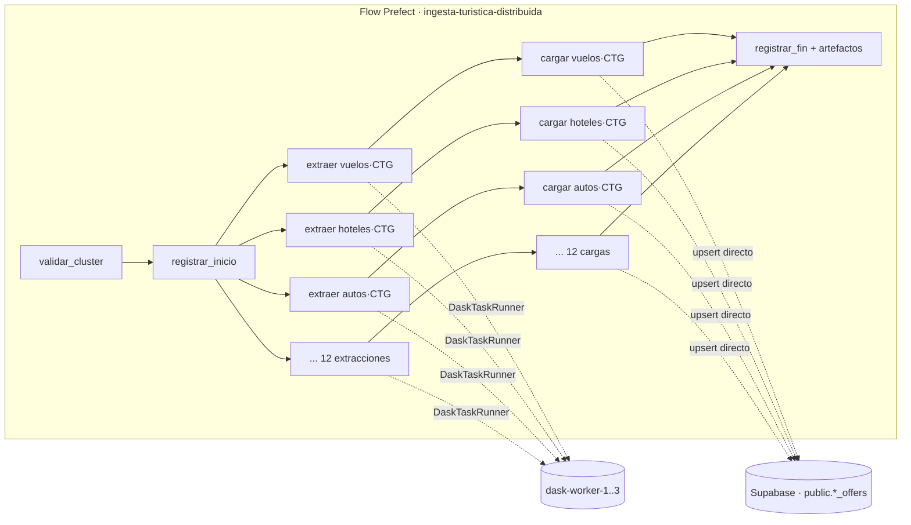

# Módulo de Web Scraping e Ingesta Distribuida

> Requisito del enunciado (sección 3): capturar itinerarios de vuelo, precios de habitaciones y disponibilidad de
> vehículos desde plataformas públicas, en forma **asíncrona y distribuida con Dask**, orquestada con **Prefect**, y
> persistir el resultado en una base de datos con **soporte GraphQL nativo** (Supabase + `pg_graphql`).

## 1. Fuentes elegidas y por qué

Antes de programar se probaron seis candidatos reales con `requests` y con Selenium headless desde el mismo equipo
de la demo (27-sep-2026):

| Candidato | Resultado de la prueba | Decisión |
|---|---|---|
| **Google Flights** | HTTP 200, resultados renderizados en el servidor, 136 `aria-label` con precio en COP | ✅ **Vuelos** |
| **Google Hotels** | HTTP 200, 18 tarjetas por página con precio, rating, imagen; acepta fechas en lenguaje natural | ✅ **Hoteles** |
| **Kayak Colombia (autos)** | Sin JS no trae resultados; con Selenium headless: 35 resultados reales | ✅ **Autos** |
| Booking.com | HTTP 202 + desafío anti-bot (AWS WAF) | ❌ |
| Despegar | HTTP 403 (Akamai) | ❌ |
| Rentalcars | Página vacía + desafío | ❌ |

Criterios: que funcione **sin CAPTCHA** ni cuentas, que traiga **precios reales en COP** y que sea **estable** para
una demo en vivo.

## 2. Cómo se extrae cada fuente

Todos los scrapers viven en [`pipeline/wandersync/scrapers/`](../pipeline/wandersync/scrapers/) y comparten
[`base.py`](../pipeline/wandersync/scrapers/base.py) (HTTP, errores reintentables, inyección de caos, parsing de
dinero).

### 2.1 Vuelos — Google Flights ([`google_flights.py`](../pipeline/wandersync/scrapers/google_flights.py))

- URL: `https://www.google.com/travel/flights?q=Flights to CTG from BOG on 2026-10-27 through 2026-10-30&hl=es&gl=co&curr=COP`
- Técnica: `requests` + BeautifulSoup. **No se usan las clases CSS** (están ofuscadas y cambian); se lee el
  `aria-label` de accesibilidad de cada vuelo, que describe todo en lenguaje natural:

  > *A partir de 865300 pesos colombianos (precio total de ida y vuelta). Vuelo directo de JetSMART. Operado por
  > Jetsmart Airlines S.a.s.. Sale de Aeropuerto Internacional El Dorado el viernes, octubre 30 a las 18:20. Llega a …
  > Duración total: 2 h 24 min.*

- Se extrae con expresiones regulares: precio, aerolínea, operador, escalas, hora de salida/llegada, aeropuertos y
  duración.

### 2.2 Hoteles — Google Hotels ([`google_hotels.py`](../pipeline/wandersync/scrapers/google_hotels.py))

- URL: `https://www.google.com/travel/search?q=hoteles en Cartagena del 27 de octubre al 30 de octubre de 2026&hl=es-419&gl=co&curr=COP`
- Truco: Google interpreta las fechas escritas en la consulta, así no hay que reproducir sus parámetros internos
  (protobuf).
- Cada tarjeta (`div.uaTTDe`, con selector de respaldo) aporta: nombre, precio por noche, total de la estadía,
  calificación y número de reseñas, estrellas, descuento, servicios, imagen y enlace.

### 2.3 Autos — Kayak ([`kayak_cars.py`](../pipeline/wandersync/scrapers/kayak_cars.py))

- URL: `https://www.kayak.com.co/cars/CTG/2026-10-27/2026-10-30` (código IATA del aeropuerto de destino).
- Kayak arma los resultados con JavaScript, así que se usa **Selenium + Chromium headless**, la misma técnica de la
  plantilla del curso (exito.com). En Docker se usan `chromium` y `chromium-driver` de Debian: misma versión,
  sin descargas en tiempo de ejecución.
- Se espera a que aparezcan tarjetas `div.js-result[data-result-id]` y a que el número se **estabilice** (Kayak sigue
  agregando proveedores mientras consulta).
- Los datos se leen de atributos semánticos: `.js-title` (modelo), `aria-label="N.º de pasajeros"`,
  `aria-label="Total: $482.719"`, `aria-label="Ver oferta de … desde $…"`.

## 3. Ventanas de viaje

Un **paquete** une vuelo + hotel + auto del **mismo destino y fechas**. Por eso las tres fuentes se consultan con la
misma `TripWindow` ([`config.py`](../pipeline/wandersync/config.py)) y comparten la llave:

```
search_key = BOG-CTG-2026-10-27-2026-10-30      (origen-destino-checkin-checkout)
```

Por defecto: origen **BOG**, destinos **CTG, SMR, MDE, CLO**, salida en 30 días, 3 noches
(`INGESTION_DAYS_AHEAD`, `INGESTION_NIGHTS`). Resultado: **4 ventanas × 3 fuentes = 12 tareas de extracción**.

> **Por qué Cali y no San Andrés:** la primera corrida real incluía San Andrés (ADZ). Vuelos y hoteles funcionaron,
> pero Kayak no devuelve ningún alquiler de autos en la isla (se verificó también fuera de Docker). La tarea agotó sus
> reintentos y la corrida terminó `PARTIAL`, que es el comportamiento esperado. Como un paquete necesita las tres
> piezas, se reemplazó por Cali (CLO). Se puede cambiar con `INGESTION_DESTINATIONS` y el diccionario `DESTINATIONS`.

## 4. Flujo distribuido (Prefect + Dask)



| Tarea | Dónde corre | Política |
|---|---|---|
| `validar_cluster` | proceso del flow | 3 reintentos (el scheduler puede estar arrancando) |
| `extraer-{fuente}-{destino}` | **worker Dask** | **3 reintentos, backoff 3 s → 8 s → 15 s con jitter 30 %**, timeout 180 s |
| `cargar-{fuente}-{destino}` | **worker Dask** | 2 reintentos (errores transitorios de BD) |
| `registrar_inicio/fin` | proceso del flow | 3 reintentos |

Detalles de diseño:

- **Fan-out con `.submit()`**: cada extracción es una tarea Prefect independiente que `DaskTaskRunner` convierte en un
  `client.submit()` de Dask; los 3 workers (2 hilos cada uno) ejecutan hasta 6 extracciones en paralelo.
- **Pipeline con `as_completed`**: apenas una extracción termina se somete su carga, sin esperar a las demás.
- **Datos entre workers**: la carga recibe el *future* de la extracción, así Dask mueve el resultado entre workers
  sin pasar por el proceso del flow.
- **Tolerancia parcial**: si una extracción agota sus reintentos, la corrida sigue con las demás y termina como
  `PARTIAL` (o `FAILED` si fallan todas, y entonces el flow queda en rojo).
- **Caos controlado**: el parámetro `chaos_fail_rate` (0–0.9) inyecta fallos de red simulados antes de cada petición;
  sirve para mostrar en vivo los reintentos en la UI de Prefect. Se puede fijar desde la UI de Prefect
  (*Custom run*) o desde el frontend (pestaña **Ingesta de datos**).
- **Observabilidad**: cada corrida publica dos artefactos en Prefect (resumen en Markdown y tabla por tarea con el
  worker que la ejecutó) y queda registrada en `public.ingestion_runs`, que el frontend consulta por GraphQL.

## 5. Transformación y limpieza ([`transform.py`](../pipeline/wandersync/transform.py))

Con pandas, dentro del worker:

1. Normaliza espacios y textos; convierte precios `"COP 102,229"`/`"$ 196.191"` a enteros.
2. Descarta precios fuera de rango razonable (errores de parsing).
3. Elimina duplicados (Google repite tarjetas entre secciones; Kayak repite modelo por proveedor y se deja el más
   barato).
4. Ordena por precio y limita a `INGESTION_MAX_PER_SOURCE` (12) por fuente y ventana.
5. Genera un **id determinístico** (SHA-1 de los campos que identifican la oferta), así una nueva corrida
   **actualiza** la misma oferta en lugar de duplicarla.

## 6. Persistencia ([`storage.py`](../pipeline/wandersync/storage.py))

- `INSERT … ON CONFLICT (id) DO UPDATE` actualiza precio y fecha, **pero no toca el inventario**
  (`seats_available`, `rooms_available`, `units_available`), que administran los microservicios al reservar o
  compensar.
- Las ofertas que no aparecieron en la corrida actual se marcan `is_active = false`.

## 7. Probar un scraper sin Docker

```bash
cd pipeline
pip install -r requirements.txt
python -m wandersync.cli flights --dest CTG
python -m wandersync.cli hotels  --dest MDE
python -m wandersync.cli cars    --dest SMR --json
python -m unittest discover tests -v        # 9 pruebas de parsers
```

## 8. Uso responsable

Proyecto académico: pausas de 1–2.5 s entre peticiones, una consulta por destino y fuente cada 6 horas por defecto,
sin evadir CAPTCHAs ni iniciar sesión, y solo datos públicos de precios. Si una fuente cambia su HTML, el scraper
lanza `ScrapeEmptyError`, Prefect lo reintenta y la corrida queda `PARTIAL` sin afectar el resto del sistema.
