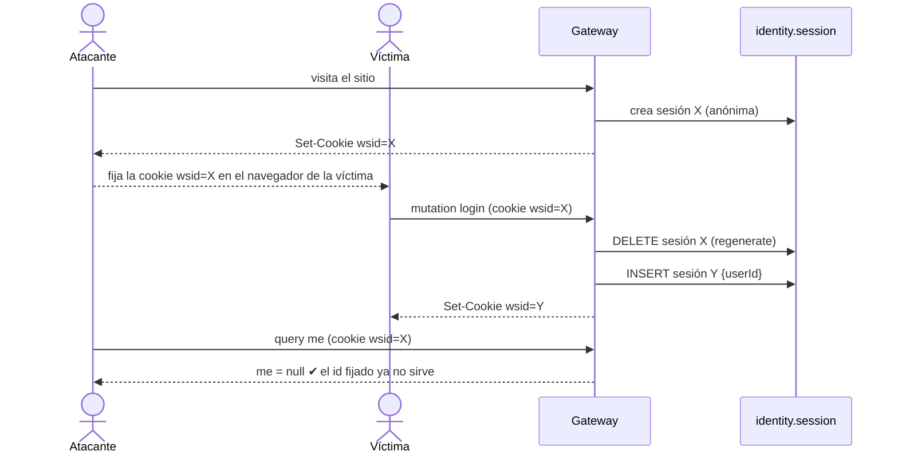
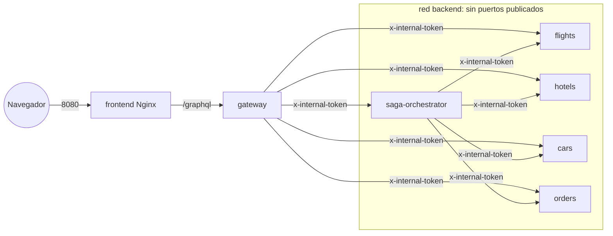

# Ciberseguridad por Diseño — WanderSync

> Requisitos de la sección 5 del enunciado (Semana 9) y criterio **"Ciberseguridad y Resiliencia" (20 %)** de la
> rúbrica. Cada control tiene su implementación, su justificación y **una prueba automática reproducible**.

**Evidencias generadas el 27-sep-2026**

| Evidencia | Archivo |
|---|---|
| Pruebas automáticas de seguridad (14/14 pasan) | [`reports/security-tests-2026-09-27.txt`](security/reports/security-tests-2026-09-27.txt) |
| `npm audit` backend (183 dependencias, 0 vulnerabilidades) | [`reports/npm-audit-backend-2026-09-27.json`](security/reports/npm-audit-backend-2026-09-27.json) |
| `npm audit` frontend (140 dependencias, 0 vulnerabilidades) | [`reports/npm-audit-frontend-2026-09-27.json`](security/reports/npm-audit-frontend-2026-09-27.json) |
| `pip-audit` pipeline (138 paquetes, 0 vulnerabilidades) | [`reports/pip-audit-pipeline-2026-09-27.json`](security/reports/pip-audit-pipeline-2026-09-27.json) |
| `pip-audit` orquestador SAGA (107 paquetes, 0 vulnerabilidades) | [`reports/pip-audit-saga-orchestrator-2026-09-27.json`](security/reports/pip-audit-saga-orchestrator-2026-09-27.json) |

Reproducir:

```bash
node scripts/security/security-tests.mjs
```

```bash
powershell -ExecutionPolicy Bypass -File scripts/security/audit.ps1
```

---

## 1. Gestión segura de identidad y sesiones

### 1.1 Mitigación de Session Fixation

**Ataque:** el atacante obtiene un id de sesión válido del servidor (visitando el sitio) y logra "fijarlo" en el
navegador de la víctima. Si al iniciar sesión el servidor conserva ese mismo id, el atacante queda autenticado como
la víctima.

**Control** ([`services/gateway/src/security/auth.js`](../services/gateway/src/security/auth.js)):

```js
export async function establishSession(req, userId) {
  const previousId = req.sessionID;
  await promisify((cb) => req.session.regenerate(cb)); // destruye la sesión previa en el store
  req.session.userId = userId;
  req.session.authenticatedAt = new Date().toISOString();
  await promisify((cb) => req.session.save(cb));
  logger.info('auth.session_regenerated', { previousSession: fingerprint(previousId), newSession: fingerprint(req.sessionID) });
}
```

Se invoca **siempre** tras `login` y `register` exitosos. `regenerate()` borra la fila de la sesión anterior en
`identity.session` (Postgres) y emite un id nuevo, así el id fijado por el atacante queda inválido.



**Endurecimiento de la cookie** (`express-session`):

| Atributo | Valor | Protege contra |
|---|---|---|
| `HttpOnly` | sí | Robo de la cookie con XSS |
| `SameSite` | `Strict` | CSRF (la cookie no viaja en peticiones de otros sitios) |
| `Secure` | `COOKIE_SECURE=true` detrás de HTTPS | Envío en texto plano |
| `maxAge` + `rolling` | 2 h de inactividad | Sesiones eternas |
| Almacén | Postgres (`connect-pg-simple`) | Revocación real en logout (`destroy`) |
| Nombre | `wsid` (no el genérico `connect.sid`) | Huella de la tecnología |

**Evidencia** (extracto de `security-tests-2026-09-27.txt`):

```
✔ PASA  Un visitante anónimo recibe una sesión (id pre-autenticación)
✔ PASA  Tras autenticarse el servidor emite un id de sesión NUEVO
         antes=s%3AKR1dt0o_O5IEAE36…  después=s%3A8eV6JljzMZpM1vYj…
✔ PASA  El id de sesión anterior ya NO da acceso a la cuenta
         me con id viejo -> {"me":null}
✔ PASA  El id nuevo sí autentica al usuario
✔ PASA  Cookie de sesión HttpOnly + SameSite=Strict
```

### 1.2 Almacenamiento de contraseñas con Argon2id

| Parámetro | Valor | Referencia |
|---|---|---|
| Algoritmo | **Argon2id** (híbrido: resiste ataques de canal lateral y de GPU) | Ganador de la Password Hashing Competition; recomendado por OWASP |
| Memoria (`m`) | **64 MiB** (65 536 KiB) | OWASP mínimo: 19 MiB |
| Iteraciones (`t`) | **3** | OWASP mínimo con 19 MiB: 2 |
| Paralelismo (`p`) | 1 | — |
| Sal | 16 bytes aleatorios por usuario (incluida en el formato PHC) | — |

Resultado almacenado (formato PHC):

```
$argon2id$v=19$m=65536,p=1,t=3$KqctIOJs6GU8CNdhdTTC+A$qJhkal…
```

Controles adicionales:

- **Anti-enumeración de usuarios por tiempo**: si el correo no existe se verifica igualmente contra un hash señuelo,
  así la respuesta tarda lo mismo exista o no la cuenta. El mensaje también es genérico
  ("Correo o contraseña incorrectos").
- **Registro sin revelar cuentas existentes**: un correo repetido devuelve un mensaje genérico.
- **Política de contraseña**: 10–128 caracteres, con letras y números (el límite superior evita DoS por hashing de
  cadenas enormes).

---

## 2. Protección de superficie y endpoints

### 2.1 Rate limiting en rutas sensibles

GraphQL expone **un solo endpoint** (`/graphql`), así que un límite por ruta HTTP no distingue entre un login y una
consulta de catálogo. Por eso se aplican **dos capas**:

| Capa | Dónde | Política |
|---|---|---|
| Global por IP | `express-rate-limit` en `/graphql` | 300 peticiones/min por IP (anti-DoS) |
| **Login por cuenta** | resolver `login` | **5 intentos/min por IP+correo → bloqueo de 5 min** (fuerza bruta) |
| Login por IP | resolver `login` | 20 intentos/15 min por IP (credential stuffing contra muchas cuentas) |
| Registro | resolver `register` | 5/15 min por IP (creación masiva de cuentas) |
| **Checkout de reservas** | resolver `bookPackage` | **5/min por usuario** (cada reserva dispara cobros) |
| Ingesta | resolver `triggerIngestion` | 3/5 min por usuario (protege las fuentes de scraping) |
| **Pago** (defensa en profundidad) | `orders` → `POST /payments` | **5 intentos/10 min por orden** (card testing) |

Implementación: [`security/limits.js`](../services/gateway/src/security/limits.js) con `rate-limiter-flexible`. El
error devuelto es tipado:

```json
{ "message": "Demasiados intentos de inicio de sesión. Intenta de nuevo en 300 s.",
  "extensions": { "code": "TOO_MANY_REQUESTS", "retryAfterSeconds": 300 } }
```

Tras un login exitoso se reinicia el contador de esa cuenta.

**Evidencia:**

```
✔ PASA  Login: tras 5 intentos fallidos se bloquea (anti fuerza bruta)
         respuestas: UNAUTHENTICATED ×5, TOO_MANY_REQUESTS, TOO_MANY_REQUESTS
✔ PASA  Durante el bloqueo, ni la contraseña correcta entra
✔ PASA  Checkout de reservas: máximo 5 por minuto por usuario
         respuestas: BAD_USER_INPUT ×5, TOO_MANY_REQUESTS
```

> Los contadores viven en memoria del gateway (suficiente para una instancia). Con varias réplicas se usaría
> `RateLimiterRedis`, que tiene la misma API.

### 2.2 Endurecimiento del API GraphQL

| Control | Detalle |
|---|---|
| Límite de profundidad | Regla de validación propia: consultas con profundidad > 6 se rechazan **antes** de ejecutar resolvers |
| CSRF prevention | `csrfPrevention: true` de Apollo: rechaza peticiones "simples" (GET/form) sin cabecera de preflight |
| Errores internos ocultos | `formatError` reemplaza errores no tipados por "Error interno del servidor" y los registra en el log |
| Tamaño de petición | 100 KB máx. en Express y en Nginx |
| Autorización por objeto (anti-IDOR) | `order(id)` verifica que la orden pertenezca al usuario de la sesión |
| Validación de entrada | `searchKey` con regex; viajeros 1–4; enum `FailureTarget`; precios nunca vienen del cliente |

### 2.3 Superficie de red y servicios internos



- **Segmentación**: el frontend solo está en la red `edge`; los microservicios de dominio solo en `backend` y **no
  publican puertos** al host.
- **Token interno** (`INTERNAL_API_TOKEN`): todo servicio interno rechaza con 401 las llamadas sin
  `x-internal-token`, aunque el atacante llegue a la red interna.
- **Row Level Security** en Supabase ([`003_security.sql`](../db/migrations/003_security.sql)): las tablas de `public`
  (expuestas automáticamente por PostgREST/pg_graphql con la anon key) solo permiten `SELECT` a `anon`/`authenticated`;
  los esquemas de dominio revocan todo acceso público.
- **Contenedores sin root**: `node` (servicios Node), `wander`/`saga` uid 10001 (Python), `nginx-unprivileged`.
- **Cabeceras HTTP**: `helmet` en todos los servicios; en Nginx CSP estricta (`default-src 'self'`,
  `frame-ancestors 'none'`), `X-Frame-Options: DENY`, `nosniff`, `Referrer-Policy: no-referrer`.
- **Secretos** solo por variables de entorno (`.env` en `.gitignore`); el gateway no arranca si `SESSION_SECRET`
  tiene menos de 32 caracteres.

---

## 3. Seguridad en la cadena de suministro (Supply Chain Security)

### 3.1 Reporte formal de auditoría — 27 de septiembre de 2026

| Componente | Herramienta | Alcance | Paquetes auditados | Vulnerabilidades |
|---|---|---|---|---|
| Backend Node (gateway, 4 microservicios, migrator, common) | `npm audit` (registro npm / GitHub Advisory DB) | Árbol completo del `package-lock.json` de los workspaces | 183 | **0** |
| Frontend (React, Apollo, Vite) | `npm audit` | Árbol completo incluyendo devDependencies de build | 140 | **0** |
| Pipeline Dask/Prefect/scraping | `pip-audit` (PyPI Advisory DB / OSV) | `pipeline/requirements.txt` resuelto con dependencias transitivas | 138 | **0** |
| Orquestador SAGA | `pip-audit` | `services/saga-orchestrator/requirements.txt` resuelto | 107 | **0** |
| **Total** | | | **568** | **0** |

Conclusión: **ninguna dependencia directa ni transitiva tiene vulnerabilidades conocidas** a la fecha de la auditoría.
Los reportes crudos (JSON y texto) están en [`docs/security/reports/`](security/reports/).

### 3.2 Prácticas que reducen el riesgo de RCE y librerías comprometidas

| Práctica | Dónde |
|---|---|
| **Versiones fijadas** (`==`) en Python y **lockfiles** (`package-lock.json`) en Node | `requirements.txt`, `package-lock.json` |
| **`npm ci`** en las imágenes: instala exactamente el lockfile y falla si no coincide | `docker/node-service.Dockerfile`, `frontend/Dockerfile` |
| `npm ci --omit=dev` y **solo las dependencias del servicio** (`--workspace`) | Imagen de cada microservicio |
| Imágenes base oficiales y fijadas (`node:22-slim`, `python:3.11-slim-bookworm`, `nginx-unprivileged:1.27-alpine`) | Dockerfiles / compose |
| Chromium y chromedriver desde el repositorio firmado de Debian (sin descargas en tiempo de ejecución) | `pipeline/Dockerfile` |
| Compatibilidad fijada tras detectar un fallo por actualización transitiva (SQLAlchemy 2.1 rompía el scheduler de Prefect) → `sqlalchemy==2.0.54` | `pipeline/requirements.txt` |
| Auditoría repetible con un comando | `scripts/security/audit.ps1` / `audit.sh` |

> Recomendación para CI: ejecutar `audit.sh` en cada *merge request* y fallar el pipeline con
> `npm audit --audit-level=high` y `pip-audit --strict`.

---

## 4. Resiliencia (complemento del criterio 20 %)

| Riesgo | Control |
|---|---|
| Fallo parcial en una reserva | SAGA con compensaciones idempotentes ([ARQUITECTURA §7](ARQUITECTURA.md#7-patrón-saga)) |
| Fallo de red en el scraping | Reintentos con backoff y jitter en Prefect; estado `PARTIAL` sin afectar el resto |
| Caída de un worker Dask | El scheduler reprograma las tareas en los workers vivos |
| Servicio interno caído | El gateway responde `SERVICE_UNAVAILABLE` tipado; ningún servicio se cae por un error de otro |
| Reintentos duplicados | Idempotencia por `sagaId` / `order_id` con restricciones `UNIQUE` |
| Arranque desordenado | `depends_on` con `healthcheck` y `service_completed_successfully` |
